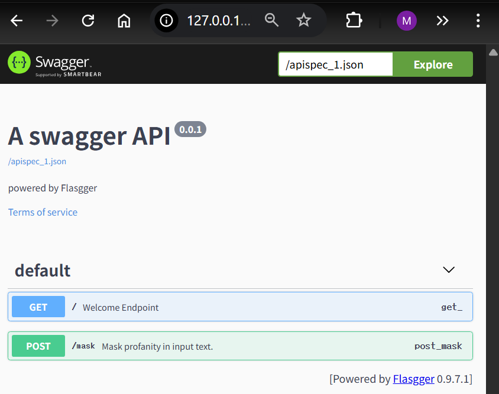

# Smart TA: Profanity Masker API
> An AI-driven, automated text filtering service built with Flask.

## 📸 Visual Demonstration


## 🚀 Live Documentation Links
* **Technical Docs (Sphinx):** https://maniharafiqkr-hue.github.io/workspace_osp/
* **API Sandbox (Flasgger):** Run locally and visit `http://127.0.0.1:5000/apidocs/`

## 💡 Motivation & Problem
This project was built to explore the integration of Test-Driven Development (TDD) and AI-driven refactoring. The goal was to create a reliable, easily maintainable text-filtering API that can be used in educational or community platforms to enforce safe-for-work guidelines.

## 🛠 Tech Stack & Rationale
* **Python 3 / Flask:** Chosen for its lightweight, micro-framework architecture, perfect for standing up quick APIs.
* **Flasgger:** Used to generate an interactive OpenAPI (Swagger) interface directly from Python docstrings.
* **Sphinx:** Selected for generating comprehensive, cross-linked technical HTML documentation from our codebase.
* **Pytest:** Utilized to enforce strict Test-Driven Development (TDD) and prevent regressions during refactoring.

## ✨ Key Features
* **Intelligent Masking:** Preserves the first letter of banned words while masking the rest with asterisks.
* **Case-Insensitive Filtering:** Accurately catches uppercase, lowercase, and mixed-case variations.
* **Interactive API Documentation:** Built-in Swagger UI for instant endpoint testing.
* **Extensible Design:** Utilizes the Strategy Pattern to easily inject new banned-word lists.

## 🏁 Getting Started Guide
To run this project locally, simply run the following commands in your terminal:
```bash
git clone [https://github.com/maniharafiqkr-hue/workspace_osp.git](https://github.com/maniharafiqkr-hue/workspace_osp.git)
cd workspace_osp
python -m venv .venv
.venv\Scripts\activate
pip install -r requirements.txt
python app.py
Then open http://127.0.0.1:5000/apidocs/ in your browser!
```

## 🧠 Lessons Learned & Challenges
The biggest challenge was migrating the core profanity logic from a standalone function into an Object-Oriented ProfanityFilter class without breaking our existing TDD test suite. We solved this by implementing the Facade Pattern, creating a wrapper function that instantiated the class to maintain backwards compatibility with the tests while vastly improving the internal architecture.
